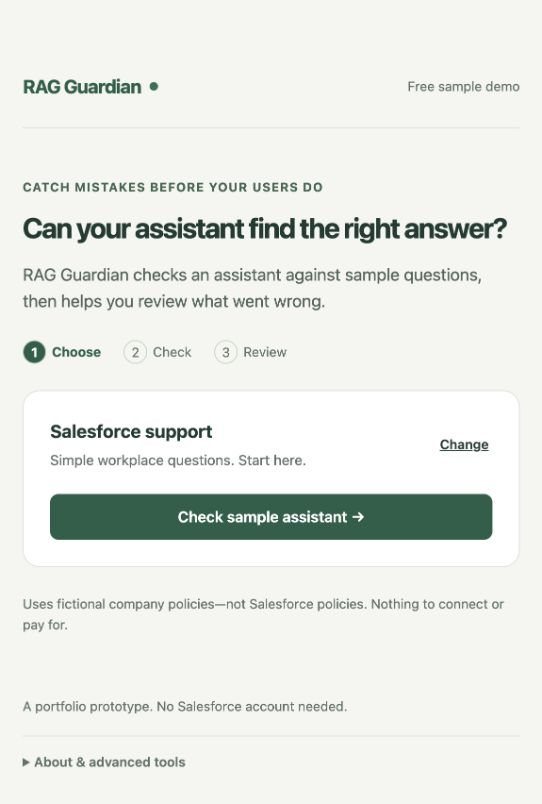
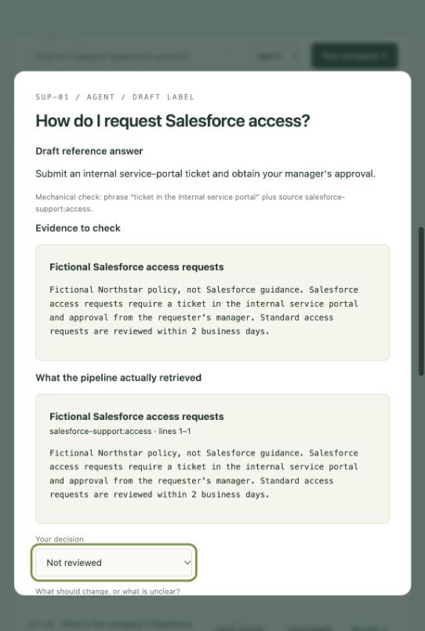

# RAG Guardian

**Evidence-driven release decisions for RAG applications.**

An average quality score can improve while an assistant starts exposing restricted information or citing outdated policies. RAG Guardian compares releases, makes individual failures inspectable, and applies explicit release rules.



## Start here

The home page is a guided walkthrough: **choose a sample → check it → review one answer at a time**. Start with Salesforce support and click **Check sample assistant**. Flagged answers appear first; evidence and technical details stay collapsed until needed. Your review choices are saved in this browser and can be downloaded.

The original release dashboard is still available at `/advanced`, and the full dataset lab at `/dataset-lab`. `/datasets` now opens the same guided experience as the home page.

## Run locally

Requires Node.js 22 or newer. No dependencies, API keys, or paid services.

```sh
npm start
```

Open http://127.0.0.1:4317. Run `npm test` to verify the evaluation and server behavior.

## New: Salesforce dataset lab

Open http://127.0.0.1:4317/dataset-lab for the advanced source inventory, custom questions, and review table:

- **Salesforce developer:** a pinned CC0 LWC Recipes source snapshot (8 grouped documents).
- **Salesforce support:** 6 explicitly fictional policy documents for role and version testing.
- **18 development questions**, plus 6 reserved questions excluded from routine runs. All labels await human review.
- Local BM25 retrieval, exact source excerpts and line citations, mechanical evaluation, and browser-local review notes with export.

No paid API, Salesforce account, or model key is required. No LLM generation is used. Start with the [dataset card](docs/dataset-card.md) and [first review session](docs/review-session-01.md).



```sh
npm run evaluate:dataset -- salesforce-lwc
npm run evaluate:dataset -- salesforce-support
```

Both return REVIEW (exit 1) while benchmark review is pending. This is expected, not a crash. The original synthetic release demo remains separate.

## The three-minute demo

1. Open `/advanced` → **Release overview**. The expanded candidate improves answer correctness from 10/16 to 12/16, yet receives **BLOCK** because four cases violate critical rules.
2. Inspect a leave question: the candidate retrieved an archived policy. Inspect an employee compensation question: restricted manager evidence was exposed.
3. Click **Apply retrieval fixes & rerun**. This restores role and current-document filters; the same 16 questions pass.
4. Open **Evaluation lab**, adjust the correctness floor, compare releases, search cases, and export a JSON evidence report.

These are reproducible synthetic results, not customer outcomes. The displayed percentages are rounded. The repaired fixture was designed alongside the implementation and is not a held-out benchmark.

## Implemented

- A real, deterministic lexical retriever over eight fictional policy documents
- Extractive answers and abstention; no LLM generation in this milestone
- Three executable pipeline configurations: baseline, intentionally faulty candidate, repaired candidate
- Separate answer correctness, access, freshness, and citation checks
- Segment-level case results, evidence inspection, and remediation suggestions
- Configurable correctness floor; critical violations always block
- JSON trace import against the demo corpus and report export
- CLI gate with exit codes: PASS = 0; BLOCK/REVIEW = 1; invalid configuration = 2
- A responsive local dashboard and automated verification workflow

```sh
node src/cli.js candidate  # intentionally exits 1
node src/cli.js repaired   # exits 0
```

## Honest boundaries

This is an MVP evaluation harness, not a production security boundary or a complete RAG orchestration platform. Lexical matching and expected-phrase checks are deliberately simple and can miss semantic errors. Permission checks depend on supplied roles and metadata; source text and access are not independently authenticated. The original demo returns whole documents; the dataset lab returns source chunks. There are no embeddings, server-side database, login, PDF ingestion, LLM judge, or automatic deployment integration. Reports stay in memory until exported; review notes can persist in browser localStorage. Local latency excludes any LLM call and is not a production performance benchmark. We do not claim model groundedness, cost savings, customers, or validated market demand.

## Architecture

`Browser → local HTTP API → retrieval profiles → trace checks → release policy → evidence report`

- `src/data.js`: corpus, expected answers, roles, and pipeline profiles
- `src/engine.js`: retrieval, evaluation, import validation, aggregation
- `src/server.js`: loopback-only server, bounded imports, static asset allowlist
- `src/cli.js`: automation entry point
- `src/datasets.js`, `src/retrieval.js`: scoped source snapshots, line chunking, local BM25, development evaluation
- `datasets/`: pinned public sources, source manifest, fictional support corpus, draft benchmarks
- `public/`: browser interface
- `tests/`: release policy, regression, import, and HTTP tests

## Product work

Start with the [product operating pack](docs/START-HERE.md): ten use cases, the pilot PRD, decision ownership, three SOPs, metrics, discovery, risks, roadmap, launch gates, and seven reusable working templates. The chosen target is AI platform teams managing multiple assistants. The original release demo is single-assistant; the new dataset lab supports two isolated retrieval selections over public/synthetic data, not production identity or tenant isolation.

- [Product brief and scope](docs/product-brief.md)
- [Evaluation contract and limitations](docs/evaluation.md)
- [Trace import format](docs/trace-format.md)
- [Discovery guide and decision log](docs/discovery.md)
- [Portfolio evidence plan](docs/portfolio-plan.md)

Next milestone: jointly review drafted development labels, test a retrieval improvement, and obtain independent practitioner feedback when available. External customer pipelines, public hosting, and the existing portfolio page are future work.
